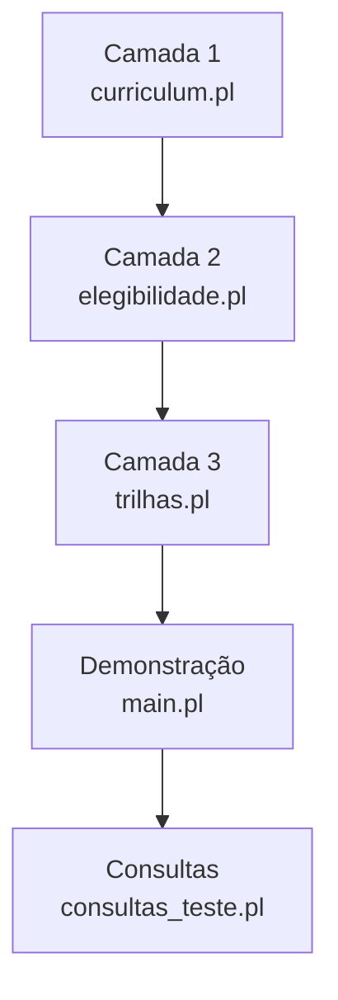

# Sistema de Trilhas de Disciplinas em Prolog

> Projeto acadêmico que modela uma matriz curricular, verifica a elegibilidade de estudantes e gera trilhas válidas para a conclusão do curso.

[](https://www.swi-prolog.org/)
[](https://www.swi-prolog.org/)
[](https://swish.swi-prolog.org/)

## Visão geral

O sistema representa uma grade curricular e responde perguntas como:

- Quais disciplinas um estudante já pode cursar?
- Quais disciplinas obrigatórias ainda estão pendentes?
- Quantos créditos já foram concluídos?
- Um pré-requisito é direto ou transitivo?
- Existe ciclo na rede de pré-requisitos?
- Como distribuir as disciplinas restantes em semestres válidos?

O projeto foi dividido em três camadas. A separação deixa as regras mais fáceis de testar, explicar e evoluir.



## Funcionalidades

| Camada | Responsabilidade | Principais predicados |
|---|---|---|
| 1 — fatos | Disciplinas, créditos, períodos, pré-requisitos e históricos | `disciplina/4`, `prerequisito/2`, `cursou/2` |
| 2 — regras | Elegibilidade, pendências e total de créditos | `prerequisitos_ok/2`, `pode_cursar/2`, `disciplinas_liberadas/2`, `disciplinas_pendentes/2`, `creditos_cursados/2` |
| 3 — busca | Fecho transitivo, ciclos e geração de trilhas | `prerequisito_transitivo/2`, `existe_ciclo/1`, `trilha_valida/3` |

### Perfis de estudantes

O histórico utiliza três perfis fictícios para produzir cenários diferentes de teste:

| Estudante | Perfil | Finalidade |
|---|---|---|
| `ana` | avançado | Testar uma trilha menor, com boa parte do curso concluída |
| `bruno` | regular | Testar liberação gradual de disciplinas intermediárias |
| `carla` | atrasado | Testar bloqueios por pré-requisitos e uma trilha mais longa |

> Os nomes são átomos Prolog e, por isso, devem ser escritos em letras minúsculas nas consultas.

## Estrutura do projeto

```text
PjBL1-Sistemas-de-Trilha-de-Disciplinas/
├── src/
│   ├── curriculum.pl
│   ├── elegibilidade.pl
│   ├── trilhas.pl
│   └── main.pl
├── tests/
│   └── consultas_teste.pl
├── docs/
│   └── decisoes.md
└── README.md
```

## Requisitos

- [SWI-Prolog](https://www.swi-prolog.org/Download.html) 8 ou superior;
- Git, somente se o projeto for clonado do GitHub;
- um terminal, PowerShell ou o ambiente online [SWISH](https://swish.swi-prolog.org/).

Não há bibliotecas externas para instalar. O projeto usa recursos já incluídos no SWI-Prolog.

## Executando localmente

### 1. Clonar e entrar no projeto

```bash
git clone https://github.com/nicolasletti/PjBL1-Sistemas-de-Trilha-de-Disciplinas.git
cd PjBL1-Sistemas-de-Trilha-de-Disciplinas
```

### 2. Iniciar o programa

```bash
swipl -s src/main.pl
```

Quando aparecer o prompt `?-`, execute:

```prolog
demo.
```

Para sair:

```prolog
halt.
```

### 3. Executar consultas separadamente

O arquivo de consultas foi organizado para permitir a revisão de um caso por vez:

```bash
swipl -s tests/consultas_teste.pl
```

No prompt do Prolog, veja o menu:

```prolog
consultas_disponiveis.
```

Depois chame somente a consulta desejada, por exemplo:

```prolog
consulta_05_liberadas_ana.
consulta_09_pendentes_bruno.
consulta_17_trilha_carla.
```

Use o nome exato exibido por `consultas_disponiveis/0`. Se um predicado não aparecer, salve o arquivo e recarregue-o com `make.` ou reinicie o SWI-Prolog.

## Executando no SWISH

O SWISH roda Prolog no navegador, mas cada arquivo do projeto precisa existir no mesmo *programa* ou ser combinado em um único arquivo.

### Opção A — arquivo único, mais simples

1. Abra [swish.swi-prolog.org](https://swish.swi-prolog.org/).
2. Copie para o editor, nesta ordem:
   1. conteúdo de `curriculum.pl`;
   2. conteúdo de `elegibilidade.pl`;
   3. conteúdo de `trilhas.pl`;
   4. conteúdo de `main.pl`.
3. Remova ou comente as linhas `ensure_loaded(...)`, porque todo o código estará no mesmo editor.
4. No campo **Your query goes here...**, digite `demo.`.
5. Clique em **Run!**.

### Opção B — vários arquivos no SWISH

1. Crie e salve cada arquivo no SWISH.
2. Ajuste os caminhos de `ensure_loaded/1` para os nomes salvos no ambiente.
3. Abra `main.pl` e execute `demo.`.

Para uma apresentação rápida, a opção A costuma ser a menos sujeita a erros de caminho.

## Referência dos predicados

### Camada 1 — base de fatos

#### `disciplina(Nome, Tipo, Creditos, SemestreSugerido)`

Descreve uma disciplina. `Tipo` pode ser `obrigatoria` ou `eletiva`.

```prolog
?- disciplina(Disciplina, obrigatoria, 4, 1).
```

#### `prerequisito(Disciplina, Prerequisito)`

Registra uma dependência direta. A leitura é: “para cursar `Disciplina`, antes é necessário concluir `Prerequisito`”.

```prolog
?- prerequisito(poo, programacao_imperativa).
true.
```

#### `cursou(Aluno, Disciplina)`

Representa uma disciplina concluída com aprovação.

```prolog
?- cursou(ana, poo).
true.
```

### Camada 2 — elegibilidade

#### `prerequisitos_ok(Aluno, Disciplina)`

É verdadeiro quando todos os pré-requisitos diretos da disciplina constam no histórico do estudante.

```prolog
?- prerequisitos_ok(bruno, poo).
true.
```

#### `pode_cursar(Aluno, Disciplina)`

Verifica simultaneamente se a disciplina existe, ainda não foi concluída e tem todos os pré-requisitos atendidos.

```prolog
?- pode_cursar(bruno, poo).
true.
```

#### `disciplinas_liberadas(Aluno, Lista)`

Produz uma lista ordenada das disciplinas que o estudante pode cursar agora.

```prolog
?- disciplinas_liberadas(carla, Lista).
```

#### `disciplinas_pendentes(Aluno, Lista)`

Lista somente as disciplinas obrigatórias ainda não concluídas.

```prolog
?- disciplinas_pendentes(ana, Lista).
```

#### `creditos_cursados(Aluno, Total)`

Soma os créditos das disciplinas concluídas, sem duplicar matérias no cálculo.

```prolog
?- creditos_cursados(bruno, Total).
```

### Camada 3 — recursão e busca

#### `prerequisito_transitivo(Disciplina, Ancestral)`

Encontra pré-requisitos diretos e indiretos. Uma lista de visitados evita recursão infinita caso exista um ciclo acidental.

```prolog
?- prerequisito_transitivo(programacao_logica_funcional, raciocinio_algoritmico).
true.
```

#### `existe_ciclo(Disciplina)`

Verifica se uma disciplina consegue voltar a si mesma seguindo relações de pré-requisito.

```prolog
?- existe_ciclo(Disciplina).
false.
```

#### `trilha_valida(Aluno, MaxCreditos, Trilha)`

Gera, por *backtracking*, uma possível distribuição das disciplinas obrigatórias pendentes. Cada semestre respeita:

- o limite informado de créditos;
- os pré-requisitos já cumpridos no histórico simulado;
- pelo menos uma disciplina;
- o limite global de 12 semestres.

```prolog
?- once(trilha_valida(ana, 24, Trilha)).
```

Digite `;` após uma resposta para solicitar outra trilha possível. Use `once/1` quando quiser apenas a primeira solução.

## Consultas recomendadas para a apresentação

### Consultar disciplinas de um período

```prolog
?- findall(D, disciplina(D, _, _, 3), Disciplinas).
```

### Comparar os três perfis

```prolog
?- disciplinas_liberadas(ana, LiberadasAna).
?- disciplinas_liberadas(bruno, LiberadasBruno).
?- disciplinas_liberadas(carla, LiberadasCarla).

?- disciplinas_pendentes(ana, PendentesAna).
?- disciplinas_pendentes(bruno, PendentesBruno).
?- disciplinas_pendentes(carla, PendentesCarla).
```

### Demonstrar negação por falha

```prolog
?- pode_cursar(bruno, poo).
true.

?- pode_cursar(ana, poo).
false.
```

No segundo caso, `ana` já cursou `poo`, portanto a regra impede a repetição da disciplina.

### Demonstrar uma cadeia de profundidade três

```prolog
?- prerequisito_transitivo(programacao_logica_funcional, raciocinio_algoritmico).
true.
```

A cadeia percorrida é:

`raciocinio_algoritmico` → `programacao_imperativa` → `poo` → `programacao_logica_funcional`.

### Gerar uma trilha para cada estudante

```prolog
?- once(trilha_valida(ana, 24, TrilhaAna)).
?- once(trilha_valida(bruno, 24, TrilhaBruno)).
?- once(trilha_valida(carla, 24, TrilhaCarla)).
```

### Obter três alternativas com segurança

```prolog
?- use_module(library(solution_sequences)).
?- findnsols(3, T, trilha_valida(ana, 24, T), Trilhas).
```

Evite `findall(T, trilha_valida(...), Todas)` sem limite. Como cada semestre admite diferentes combinações e ordens, a quantidade de respostas cresce muito rapidamente e pode esgotar a pilha do Prolog.

## Estratégia de testes

O arquivo `tests/consultas_teste.pl` reúne consultas independentes, numeradas na ordem das camadas:

1. fatos e estrutura do currículo;
2. disciplinas liberadas, pendentes, créditos e negação;
3. transitividade, ciclos e trilhas;
4. robustez para entradas inválidas.

Para testar um ciclo sem contaminar a base principal, carregue o projeto e adicione temporariamente fatos como estes em um arquivo de teste separado:

```prolog
prerequisito(teste_a, teste_b).
prerequisito(teste_b, teste_a).
```

Então consulte:

```prolog
?- existe_ciclo(teste_a).
true.
```

Não inclua esse ciclo em `curriculum.pl`, pois a geração normal de trilhas exige uma base curricular sem ciclos.

## Decisões importantes

- **Mundo fechado:** o que não está registrado como `cursou/2` é tratado como não concluído.
- **Histórico imutável:** a simulação usa listas, sem `assert/1` ou `retract/1`.
- **Busca declarativa:** combinações de disciplinas são produzidas por recursão e *backtracking*.
- **Proteção contra ciclos:** o fecho transitivo mantém uma lista de nós visitados.
- **Resultado reproduzível:** listas retornadas ao usuário são ordenadas com `sort/2`.
- **Escopo da trilha:** a busca planeja as disciplinas obrigatórias pendentes; eletivas podem ser tratadas em uma extensão futura.

Mais detalhes estão em [`docs/decisoes.md`](docs/decisoes.md).

## Solução de problemas

| Problema | Causa provável | Como resolver |
|---|---|---|
| `swipl: command not found` | SWI-Prolog não instalado ou fora do `PATH` | Instale o SWI-Prolog e reabra o terminal |
| `source_sink ... does not exist` | Comando executado fora da raiz do projeto | Use `cd` para entrar na pasta que contém `src` e `tests` |
| `Unknown procedure` | Arquivo incorreto ou alterações não recarregadas | Carregue `main.pl` ou `consultas_teste.pl` e execute `make.` |
| consulta não aparece no menu | Menu desatualizado ou arquivo não salvo | Confira o nome do predicado, salve e use `make.` |
| `Stack limit exceeded` | Tentativa de materializar todas as trilhas | Use `once/1`, `limit/2` ou `findnsols/4` |
| caminho funciona localmente, mas não no SWISH | Os arquivos não foram salvos no mesmo programa | Use a opção de arquivo único ou ajuste `ensure_loaded/1` |

## Cobertura dos requisitos acadêmicos

- [x] base com disciplinas obrigatórias e eletivas;
- [x] grade com seis períodos;
- [x] cadeia de pré-requisitos com profundidade mínima de três;
- [x] três perfis fictícios de estudantes;
- [x] uso de `forall/2`, negação por falha e agregação de soluções;
- [x] fecho transitivo e detecção de ciclos;
- [x] geração de múltiplas trilhas por *backtracking*;
- [x] limite de créditos e máximo de 12 semestres;
- [x] demonstração e consultas independentes;
- [x] documentação das decisões de modelagem.

## Próximas evoluções

- transformar as consultas em testes automatizados com `plunit`;
- gerar um relatório visual da trilha escolhida;
- permitir uma quantidade mínima configurável de créditos eletivos;
- considerar oferta por período, choque de horários e limite mínimo de créditos;
- fornecer mensagens de erro mais descritivas para entradas inválidas.

---

Projeto desenvolvido para fins acadêmicos e para demonstrar programação lógica, recursão, negação por falha e busca com *backtracking* em Prolog.
